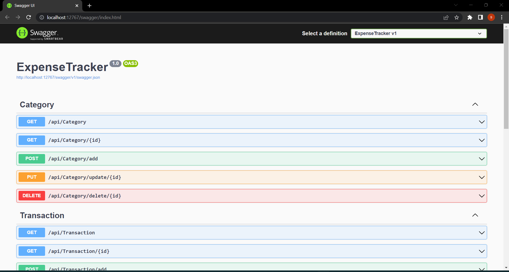
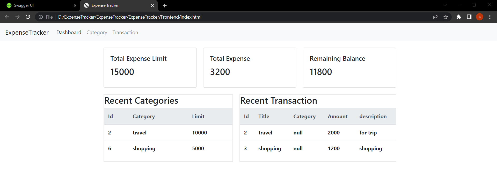

# Welcome to Expense Tracker!

Hi! I'm your guide to expense tracker project. read me to run the project.

# Prerequisites

-  Visual Studio (2022)
-  .NET Framework
-  .NET Core 
-  NUGet packages
	- ASP.NET Core entity framework
	- ASP.NET Core SQL Server
	- ASP.NET Core Tools
	- ASP.NET Core Design
	- ASP.NET Core Cors
	- Swagger

## Steps for installation
step 1: Open visual studio code
step 2: Install the prerequisites
step 3: Load the project
step4: Use command update-database in your package manager
step5: Run the program
step6: Let the swagger run
step7: Open the index.html from the directory
## Screenshots

